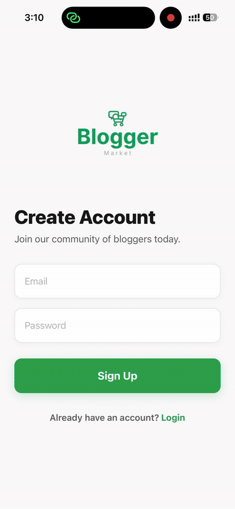
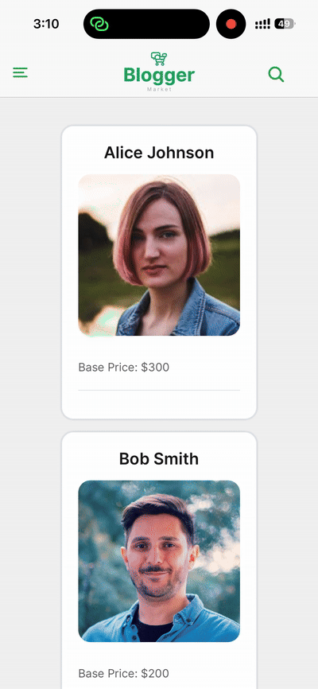

<b>
BloggerMarket
</b>  
is a high-performance mobile marketplace built with React Native (Expo). It serves as a proof-of-concept for a creator-economy platform, allowing users to discover bloggers, view transparent video pricing, and access exclusive promotional offers. The project demonstrates advanced frontend patterns including Server-State Management, Optimized Search, and Custom Navigation.\
 
 
 

 |  |  |

 
 
 
<ul>
<b>Features:</b>

<li><b>Authentication Engine:</b> A robust mock service simulating real-world OAuth flows, featuring secure-feel input validation and persistent session state.</li>
<li><b>TanStack-Powered Discovery:</b> Real-time search and filtering of the blogger marketplace, leveraging TanStack Query for efficient data synchronization and "instant-feel" UI updates.</li>
<li><b>Blogger Insight Modals:</b>High-detail, context-aware overlays that present pricing structures and engagement stats without disrupting the user's scroll position.</li>
<li><b>Special Offers Marketplace:</b>A dedicated module for browsing time-sensitive promotions, utilizing complex list layouts and RNEUI components.</li>
<li><b>Drawer-Based Navigation:</b>A professional sidebar architecture that provides quick access to User Profiles, Market Discovery, and Settings.</li>

</ul>
 
 
 
<ul>
<b>Tech Stack:</b>
<li><b>Navigation:</b> Expo Router / Drawer Navigation (for seamless side-menu transitions).</li>
<li><b>State & Data:</b> TanStack Query (v5) — Handled caching, synchronization, and asynchronous mock data fetching.</li>
<li><b>UI Framework: React Native Elements (RNEUI)</b> combined with custom CSS-in-JS for a consistent, themeable design.</li>
<li><b>Performance:</b> Implemented debounced filtering and optimized list rendering.</li>
</ul>
 
 
 
<b>Why using TanStack Query?</b>
 
I chose TanStack Query because it handles the complexities of caching and 'stale-while-revalidate' logic automatically, which is essential for a marketplace app where prices and offers might update frequently. For the UI, RNEUI allowed me to build a professional-grade interface quickly while maintaining full control over the styling via CSS

 <b>Password:password</b>